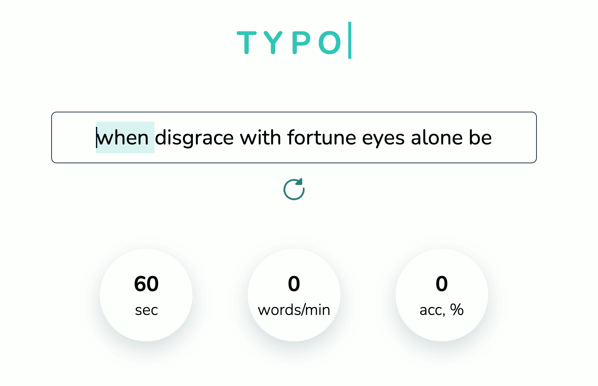
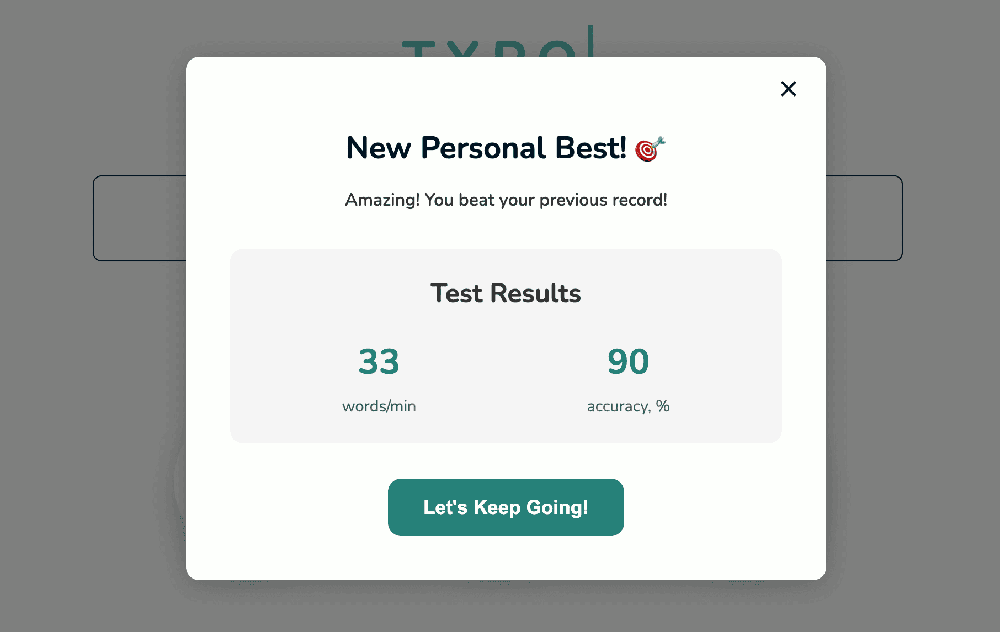
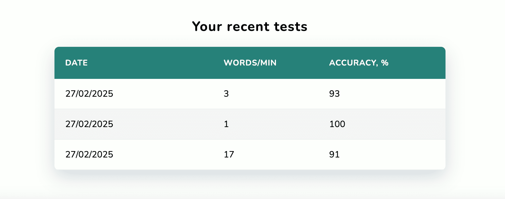

# Typo - Test Your Typing Speed

A modern, web-based typing speed test application that helps users measure and improve their typing skills.

<div align="center">
  
  <p><em>Main Interface - Typing Test Application</em></p>
  
  
  <p><em>Results Modal </em></p>

  
  <p><em>Results History Screen </em></p>
</div>

## Features

- Real-time typing speed measurement (WPM - Words Per Minute)
- Accuracy tracking
- Dynamic text fetching from Poetry API
- Test history tracking
- Personal best records
- Clean and intuitive interface

## Features in Detail

### Text Generation

- Primary source: Poetry API
- Fallback to default text if API unavailable
- Text sanitization for consistent testing

### Performance Metrics

- WPM calculation based on standard word length (5 characters)
- Real-time accuracy tracking
- Personal best tracking
- Historical results storage

### User Interface

- Clean, minimalist design
- Responsive layout
- Visual feedback for typing progress
- Animated cursor and word highlighting

## Technologies Used

- Vanilla JavaScript (ES6+)
- HTML5
- CSS3
- Poetry API for text generation

## How It Works

1. Start typing to begin the 60-second test
2. Real-time feedback on typing accuracy
3. Words are highlighted as you type
4. Results show:
   - Words per minute (WPM)
   - Accuracy percentage
   - Comparison with personal best

## Key Components

- Dynamic text window that moves as you type
- Real-time error highlighting
- Progress tracking
- Test history storage using localStorage
- Responsive modal for test results

## Getting Started

1. Clone the repository:

```bash
git clone https://github.com/EveSatke/typo.git
cd typo
```

2. Start a local server (choose one method):

   **Method 1 - VS Code (Recommended - Easiest):**

   1. Install Visual Studio Code from [https://code.visualstudio.com/](https://code.visualstudio.com/)
   2. Open VS Code
   3. Install "Live Server" extension
   4. Open your project folder in VS Code:
      - File -> Open Folder -> select the typo folder
   5. Right-click on `index.html`
   6. Select "Open with Live Server"
   7. Your default browser will open automatically with the app running

   **Method 2 - Python:**

   ```bash
   # Make sure you're in the project directory first!
   cd path/to/typo

   # If you have Python 3
   python3 -m http.server
   # The site will be available at: http://localhost:8000
   ```

   **Method 3 - Node.js:**

   ```bash
   # Make sure you have Node.js installed first
   # Install http-server globally (only need to do this once)
   npm install -g http-server

   # Then in your project directory:
   cd path/to/typo
   http-server
   ```

3. The application will now be running in your browser

Note: Opening index.html directly from the file system won't work due to browser security restrictions on module loading. You must use one of the server methods above.

## Troubleshooting

If you encounter any errors:

1. Make sure you're in the correct directory when running the server
2. Check if the port is already in use (try a different port: `python3 -m http.server 8001`)
3. Clear your browser cache and reload the page
4. Check the browser's console (F12) for specific error messages

## Controls

- `Enter` - Get new text
- `Escape` - Reset current test
- Click restart button or finish test to try again

## Configuration

The application uses a centralized configuration system defined in `config.js`. This file contains various settings organized into three main categories:

### API Configuration

```javascript
const apiConfig = {
  poetryApi: "https://poetrydb.org/random,linecount/1;14/lines",
  defaultText: "...",
};
```

- `poetryApi`: Endpoint for fetching random poetry (14 lines) from PoetryDB
- `defaultText`: Default text used for typing tests when no other content is loaded

### Storage Configuration

```javascript
const storageConfig = {
  keys: {
    history: "history",
    bestResult: "bestResult",
  },
  maxHistoryItems: 20,
};
```

- `keys`: Storage keys used for persisting data
  - `history`: Key for storing test history
  - `bestResult`: Key for storing the user's best typing test result
- `maxHistoryItems`: Maximum number of history items to store (20)

### Application Settings

```javascript
const appConfig = {
  defaultTestDuration: 60,
};
```

- `defaultTestDuration`: Default typing test duration in seconds (60)

These configuration options can be modified in the `config.js` file to customize the application's behavior.
